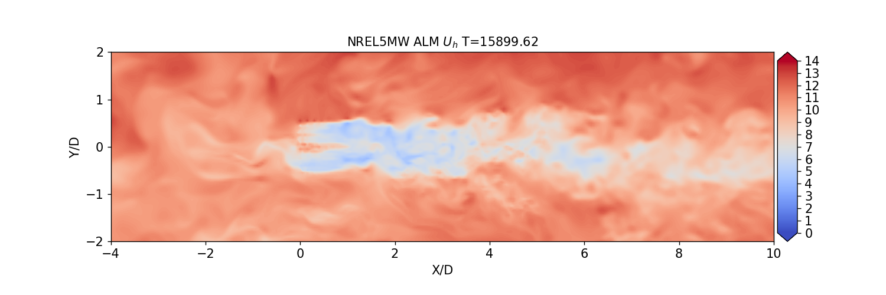

Actuator line models
=================================

`NREL5MW Actuator line model using BeamDyn and ROSCO controller <actuator_line/NREL5MW_ALM_BD/README.html>`__

NREL5MW Actuator line model with rigid blades and fixed controller

`View these cases in the github repository
<https://github.com/Exawind/exawind-benchmarks/tree/main/amr-wind/actuator_line>`__
