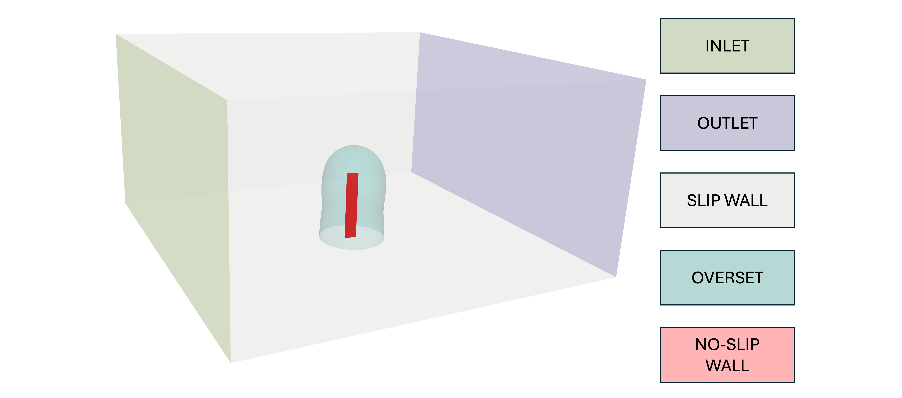
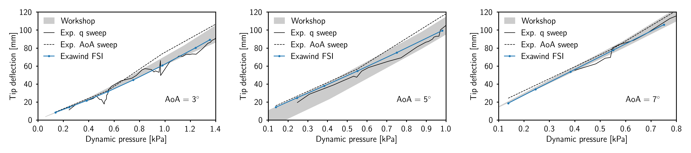
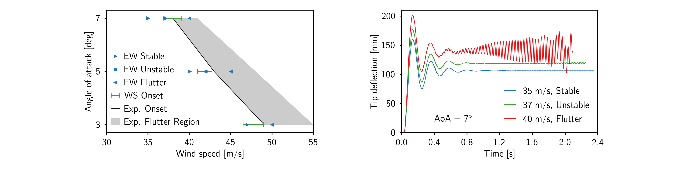

# Pazy Wing Aeroelastic Validation Case

This benchmark contains a blade-resolved model of the Pazy Wing [1] aeroelastic case in uniform flow.  A range of freestream velocities is used to assess the pre-flutter static deflection and flutter onset boundaries.  Both wind-tunnel data [1] and simulation results [2] are used for comparison.

**Contents**

- [Simulation Description and Setup](#simulation-description-and-setup)
- [Postprocessing](#postprocessing)
- [Code Performance](#code-performance)
- [Results](#results)

## Simulation Description and Setup

The geometry and flow conditions of the Pazy Wing case are defined in Avin et al. [1]  They are summarized in the following table.

| Case Property     | Value                  |
| :---              | ---                    |
| Span              | 0.55 m                 |
| Chord             | 0.10 m                 |
| Airfoil           | NACA0018               |
| Angle of Attack   | 3-7 deg                |
| Density           | 1.225 kg/m<sup>3</sup> |
| Dynamic Viscosity | 1.8E-05 Pa-s           |
| Velocity          | 15-50 m/s              |
| Mach Number       | 0.04-0.15              |
| Reynolds Number   | < 3.4E+05              |
| Turbulence Level  | 0.5%                   |

In the wind tunnel experiments [1], the intended geometry of the blade was a straight blade with no sweep or twist, matching the parameters in the above table.  However, the as-built wind-tunnel model had several small unintended features, including varying airfoil thickness along the span, sag in the flap-wise direction, and twist (about 1 degree).  It is assumed here that these features have a negligible impact on the FSI results, and the intended geometry is instead used, with a uniform cross section across the span.  

**Domain Overview**



The CFD computational domain consists of an inner Nalu-Wind domain immediately surrounding the wing, and an outer AMR-Wind domain to allow space for the wake to propagate.  The sides, ceiling, and floor of the AMR-Wind domain are intended to approximate the effect of the wind tunnel walls used in the experiment.  However, to avoid the computational expense of resolving the boundary layers near the tunnel walls, *slip wall* boundaries are used there.  The Nalu-Wind domain extends a few chord-lengths away from the wing, and terminates with an *overset* boundary on the exterior, and a *slip wall* on the portion that touches the bottom wind tunnel boundary.  The inner boundary of the Nalu-Wind domain represents the wing surface, and uses a *no-slip wall* boundary condition.

In the experiment, the wing tip passes near the wind-tunnel walls at peak deflection.  Since the Nalu-Wind domain extends several chord lengths away from the wing, the AMR-Wind domain was chosen to be somewhat larger than the wind tunnel in order to avoid collisions of the overset boundary with the slip wall at peak deflection, and additional padding was provided to ensure the results are not contaminated by the effect of the artificial slip wall boundaries.  Future studies are planned to investigate the impact of the choice of AMR-Wind domain size on the simulation results.

The structural deformations of the wing are modeled using the BeamDyn module of OpenFAST.  In the simulation setup used here, the aerodynamic forces calculated by Nalu-Wind are passed to OpenFAST/BeamDyn, and the deformations are passed back to Nalu-Wind.  No information is passed between OpenFAST/BeamDyn and AMR-Wind; instead, AMR-Wind communicates with Nalu-Wind through the overset boundary in the CFD domain.  (Note that this is different from some of the other benchmark cases, such as the  [``NREL5MW Actuator Line``](https://github.com/Exawind/exawind-benchmarks/tree/main/amr-wind/actuator_line/NREL5MW_ALM_BD) case.  There, AMR-Wind and BeamDyn communcate directly, and Nalu-Wind is not present.) 

**Grid Generation**


The Nalu-Wind grid was generated using Pointwise, and a cut-away view is shown in the left figure above.  The wing tip surface grid used an O-grid surrounding an H-grid, to which elliptic smoothing was applied.  The outer boundary of this wing tip grid was extruded to yield the complete surface mesh, shown in red above.  Finally, the volume mesh was created through hyperbolic extrusion of the surface mesh.  The grid for AMR-Wind was generated using its internal grid generator, and has one refinement region in the interior, centered around the wing.  This grid is shown in the right figure above.  Metrics for these grids are given in the table below.

| Nalu-Wind Grid Property         | Value                     |   | AMR-Wind Grid Property   | Value                  |
| :---                            | ---                       | - | :---                     | ---                    |
| Number of cells                 | 8,736,600                 |   | Domain size              | 3 m x 3 m x 1.5 m      |
| First cell height               | 1.0E-06 m                 |   | Level 0 dimensions       | 128 x 128 x 64         |
| First cell y+                   | 0.2                       |   | Number of cells          | 5,767,168              |
| Cells around airfoil            | 500                       |   | Level 0 spacing          | ~0.024 m               |
| Number of spanwise layers       | 100                       |   | Level 1 spacing          | ~0.012 m               |

For the results shown in this documentation, the same grid was used for all wind speeds and angles of attack.  The y+ value given in the above table corresponds to the highest wind speed.

**Setup**

1. Clone the Exawind-Benchmarks repository by using the following syntax:

	```bash
	$ git clone --recursive git@github.com:Exawind/exawind-benchmarks.git
	```
2. Once the repository has been cloned, navigate to the Pazy-Wing directory:

	```bash
   $ cd exawind-benchmarks/exawind/Pazy_Wing
   ```
3. Modify the "loadmod.sh" script to point to your ExaWind installation.  We assume here that you are using [Exawind-Manager](https://github.com/Exawind/exawind-manager) to build your ExaWind installation.

   ```bash
   manloc=the/location/of/your/build/exawind-manager
   envnam=pazy
   ```

   Here, `manloc` refers to the `exawind-manager` directory location, and `envname` refers to the name of the `exawind-manager` environment you will be using.  Note that if you want to use this script in an interactive terminal session, it must be sourced, rather than executed; i.e. `source loadmod.sh`.  However, this is unnecessary for most users, as the other scripts given here do this automatically.

5. Modify the slurm script (`base/template/run`) as needed for your HPC machine.  Pay particular attention to the allocation name.

6. Modify the header of the `setup.sh` script to reflect the case conditions you wish to simulate.  An example header is shown below:

   ```bash
   # Case selection
   aoa=93
   windspeed=30
   # Simulation parameters, experts only
   dtshort=0.00002
   dtlong=0.00006
   density=1.225
   visc=0.000018
   tkein=1.0
   sdrin=250.0
   amrnx=128
   cfdplotinterval=1000
   cfdcheckpointinterval=10000
   ```

   Variable description:
   - `aoa` - The angle of attack, given in degrees.  Since the nominal position of the wing is with the leading edge perpindicular to the incoming flow (per OpenFAST conventions), `aoa` should be set 90 degrees higher than the true angle of attack.  The angles of attack used in the experiment are 3, 5, and 7 degrees, so the corresponding values of `aoa` are 93, 95, and 97 degrees.
   - `windspeed` - The freestream wind velocity, given in meters per second.
   - `dtshort` - The structural timestep, in seconds.
   - `dtlong` - The CFD and driver timestep, in seconds.  This should be an integer multiple of `dtshort`.
   - `density` - The freestream air density, in kg/m^3.
   - `visc` - The freestream air dynamic viscosity, in Pa-s.
   - `tkein` and `sdrin` - The freestream turbulence model parameters.
   - `amrnx` - The number of elements in the x and y directions of the base AMR-Wind grid.
   - `cfdplotinterval` - The number of timesteps that pass in between plot file output.
   - `cfdcheckpointinterval` - The number of timesteps that pass in between checkpoint file output.

   If the user wishes to reproduce the benchmark results, only `aoa` and `windspeed` need to be modified.

7. Run the `setup.sh` script.  This will copy the simulation input files from `base` and substitute in the simulation parameters you added to the header using `aprepro`.  The resulting files will be placed in a directory titled `a#v#`, where the first number indicates the value of `aoa`, and the second indicates the value of `windspeed`.  This naming convention is chosen to facilitate parameter sweeps.  Note that this script relies on the *aprepro* preprocessor, which will be included in your exawind installation if your are using [Exawind-Manager](https://github.com/Exawind/exawind-manager).  However, if you are installing ExaWind some other way, and *aprepro* is unavailable, you can achieve the same result by manually copying the input files and editing the variables in accolades ({}), following the contents of the script.

8. Navigate to the simulation directory you just created, and submit the slurm script.

**Code Versions**

While we expect that using the current release of each code will produce comparable results, the specific versions of each code that were used to generate the results in this document are given below for completeness.

- ExaWind driver: [``046b080c7e0f0ab1efea0dccb4f798fe84ef905e``]( https://github.com/Exawind/exawind-driver/commit/046b080c7e0f0ab1efea0dccb4f798fe84ef905e)
- Nalu-Wind:  &ensp;&ensp;&nbsp;&nbsp;&nbsp;  [``b9e4ae654b646ecd0501dd6391dc7537239c82db``](https://github.com/Exawind/nalu-wind/commit/b9e4ae654b646ecd0501dd6391dc7537239c82db)
- AMR-Wind:   &ensp;&emsp;&nbsp; [``b61c01895e8eab388e4a3fd129e1db0f4fd0f534``]( https://github.com/Exawind/amr-wind/commit/b61c01895e8eab388e4a3fd129e1db0f4fd0f534) 
- OpenFAST: &ensp;&nbsp;&nbsp;&nbsp;&nbsp;&nbsp;&nbsp;[``024dbc1816ca8caeefcc720b1099397730b1ec0a``](https://github.com/OpenFAST/openfast/commit/024dbc1816ca8caeefcc720b1099397730b1ec0a)

## Postprocessing

The primary QoI is wing tip deflection, which is recorded in the OpenFAST output file `pazy.out`.  The `post.sh` script will duplicate this output file, remove its header, and run the `post.py` python script.  This will yield a plot of the tip deflection history, together with an average value for the tip deflection.

The files need to reproduce the plots in this document may be found in the `plotting` directory.  For the static deflection (low speed) cases, the final tip deflection (from the `post.py` script mentioned above) may be assembled for several windspeeds and angles of attack into the files `nalu3.dat`, `nalu5.dat`, and `nalu7.dat`.  The quantity in the first column is the wind speed, and the quantity in the second column is the tip deflection (in meters).  Running `python3 plot3.py` will reproduce the AoA=3 figure below, and the other figures may be obtained likewise.

The `plotting` directory also contains the files needed to reproduce the flutter boundary figure.  For this, you will need to do a parameter sweep (the `setup.sh` script will help with this), and run cases for several windspeeds near the flutter onset speed for each AoA (3, 5, and 7 degrees).  From the deflection history (obtained from the `post.py` script), one can determine whether each case meets the criteria for "stable", "unstable", or "flutter", as discussed in the results section below.  These speeds can be added to the files `nalustable.dat`, `naluunstable.dat`, and `naluflut.dat`.  Then, the figure may be reproduced by running `python3 plotflut.py`.

## Code Performance

For these simulations, 90% of the cores were allocated to Nalu-Wind, and the remainder to AMR-Wind.  However, the timings indicated that adding yet more cores to Nalu-Wind would yield a speed improvement in this case.  Future studies are planned to determine the optimal resource balance.

| Property              | Value                  |
| :---                  | ---                    |
| Wall-Clock Time       | 48 hours               |
| Simulated Time        | 2.09 seconds           |
| Number of Timesteps   | 34,380                 |
| Number of CPUs        | 560                    |
| Number of HPC Nodes   | 5                      |
| Nalu Cells per CPU    | ~15,600                |

The job time of 48 hours was selected for HPC queue reasons.  However, it was found that the 2 seconds of simulated time achieved after 48 hours of wall-clock time was sufficient to achieve steady state for the static deflection cases, as well as sufficient to observe the flutter behavior for the high-speed cases.  The job was run on the Sandia Flight HPC cluster, which has the following specifications:

| Parameter           | Value |
|---                  |---  |
| CPU processor type  | Intel(R) Xeon(R) Platinum 8480+ |
| CPU processor speed | 3800 Mhz |
| Node interconnects  | Cornelis Omni-Path high-speed interconnect |

## Results

**Static Deflection Results**



For wind velocities below the flutter onset boundary, the wing deformation approaches a steady state after the initial oscillatory transients decay.  The final tip deflection is a function of the freestream velocity and the root angle of attack.  Comparison data is available for three angles of attack (3, 5 and 7 degrees), and wind speeds between 15 m/s and the flutter onset speed, which depends on the angle of attack.  For each AoA, comparisons are shown above.  The two black curves are experimental data from [1].  The solid black curve is from a sweep of dynamic pressure (while holding AoA constant), and the dashed black curve is from a sweep of AoA (while holding dynamic pressure constant).  The solid black line is used as the reference for comparison in [2], and we likewise treat it as the more reliable of the two experimental data sets.  The grey band indicates the spread in computational comparison data given in [2].

**Flutter Results**



For wind velocities above the flutter onset boundary, the wing deformation initially behaves in a similar way to the pre-flutter cases above.  However, the oscillatory transients do not decay, but instead continually grow until solver failure is reached.  The quantity of interest is the flutter onset velocity.  The results are shown in the left figure above.  The grey band indicates the set of AoA and wind speed values that produced flutter in the experiment [1].  The green range indicates the spread in predictions for the onset speed from the workshop [2].  The blue symbols indicate the results of ExaWind simulations that bracket the flutter onset boundary. The next section explains how these brackets should be interpreted.

**Determination of Flutter Onset Boundary**

For wind speeds in the neighborhood of the flutter boundary, three possible behaviors of the tip deflection may be observed:
- The oscillatory transients decay, and approach a constant steady-state value.  We term this behavior "stable".
- The oscillations do not decay, but also do not grow without bound.  We term this behavior "unstable".
- The oscillations continue to grow without bound, leading to solver failure.  We term this behavior "flutter".

These three behaviors are demonstrated in the right plot above.  Since the exact speed for which flutter begins is expected to be sensitive to resolution and simulation parameters, we opt instead to bracket the flutter onset boundary; that is, for a given root AoA, we perform simulations at multiple velocities in the neighborhood of the flutter onset boundary, and determine two speeds that may be clearly classified as "stable" and "flutter", respectively.  We aim to bracket the flutter onset speed in this manner within 10% of the experimental value.  The left figure above indicates we are predicting the onset speed within this tolerance.

**References**

[1]: Avin, Or,  et al. "Experimental aeroelastic benchmark of a very flexible wing." AIAA Journal 60.3 (2022): 1745-1768.

[2]: Ritter, Markus, et al. "Collaborative Pazy wing analyses for the third aeroelastic prediction workshop." AIAA SciTech 2024 Forum. 2024.
