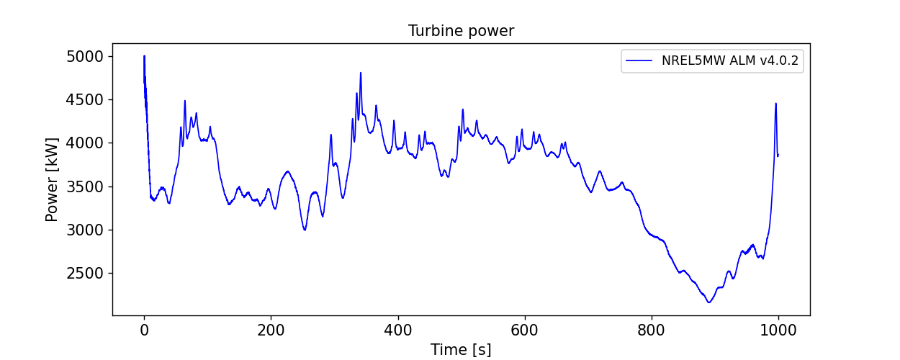
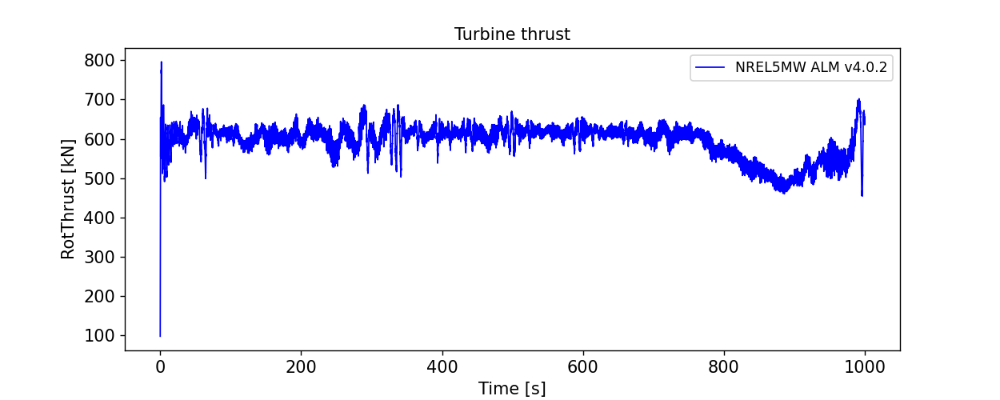
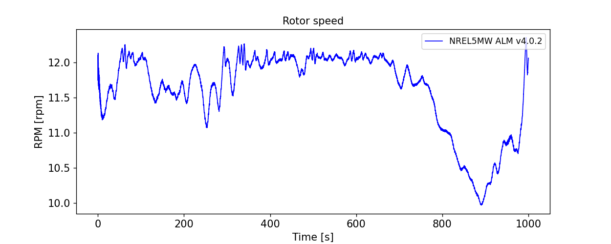
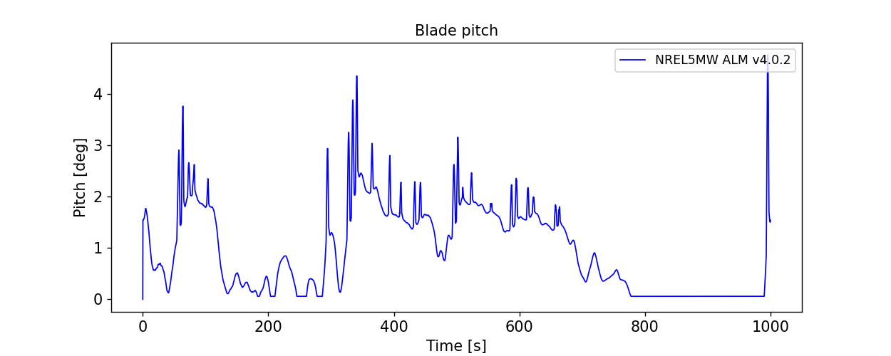
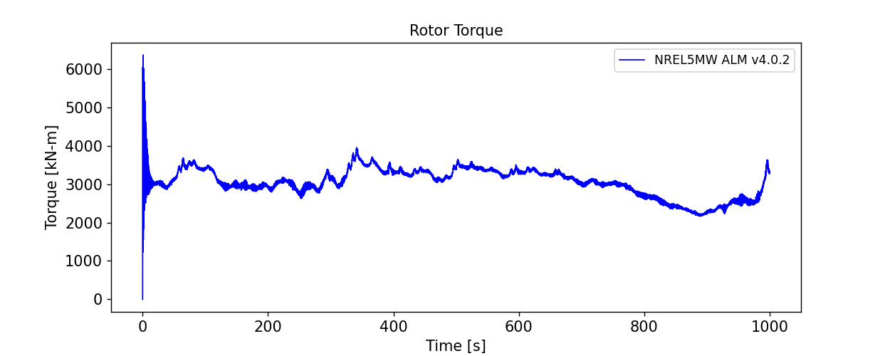
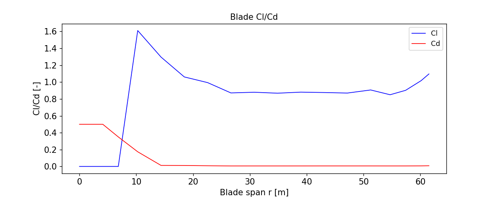
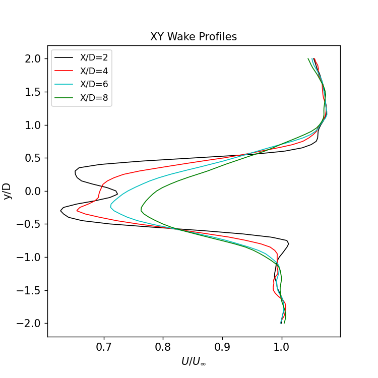
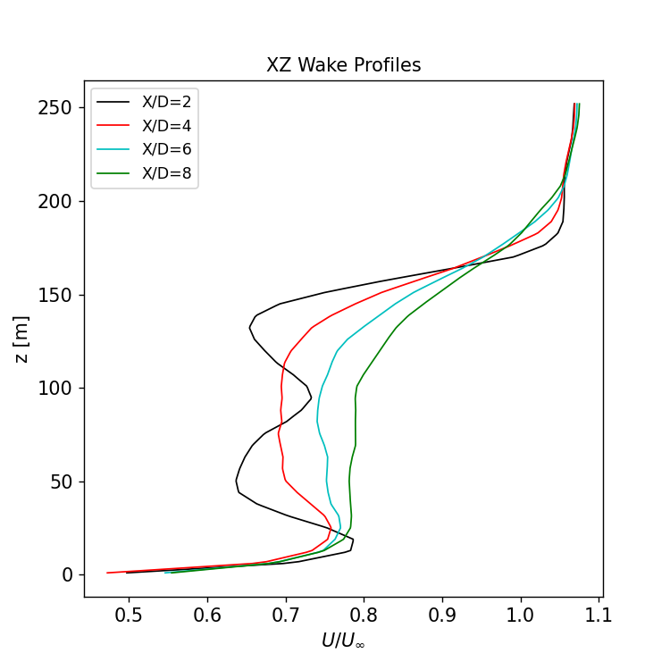

# NREL5MW results

The results of the NREL5MW ALM simulation are shown here.  Many of the scripts and notebooks used to create the results are documented in the [postprocessing](../postprocessing/README.md) section, where we describe the settings and parameters used.

## Contour visualizations

Instantaneous velocity contours of the domain and near the turbine are created using the [InstantaneousAvgPlanes](../postprocessing/InstantaneousAvgPlanes.ipynb) scripts.
The horizontal velocity contours at the hub-height (z=90m) plane at 900 seconds after the start of the simulation are shown here:

Similarly, the instantaneous horizontal velocity flow near the turbine (at the hub-height z=90m plane) at 900 seconds after the start of the simulation is depicted in the image below.  The turbine hub-height center sits at (x,y)=(0,0) in this coordinate system:

The same image in streamwise plane gives a view of the vertical structure in the wake.

## Turbine results

The time-history and time-averaged turbine performance is extracted and calculated from the OpenFAST output in the [OpenFAST_v40_Results](../postprocessing/OpenFAST_v40_Results.ipynb) scripts.  In this case, we assume that a 300 second initialization period is sufficient for the initial transients to decay and for the far wake region develop.  Averaged, 10-minute statistics from t=300s to t=900s are given in the table below

|BldPitch1    |RotSpeed    |RotThrust  |RotTorq       |GenPwr|
|---          | ----       |---        |---           |--- |
|1.152 deg    |11.701 rpm  |597.303 kN |3111.925 kN-m |3621.650 kW|

<!-- OLD RESULTS FROM DISCON.DLL --
|BldPitch1|RotSpeed|RotThrust|RotTorq |GenPwr|
|---      | ----   |---      |---     |--- |
|0.480    |11.819  |679.398  |3799.127|4460.008|
-->

The full time history of the turbine power, rotor thrust, rotor speed, blade pitch, and rotor torque are also shown here:

## Blade loading profiles

The averaged blade loading profiles and aerodynamic properties as a function of the blade span are calculated in the [OpenFAST_SectionalLoading](../postprocessing/OpenFAST_SectionalLoading.ipynb) scripts.  These include the angle of attack (AOA), inflow angle (Phi), lift/drag (Cl/Cd), and streamwise/tangential force (Fx/Fy) loading profiles shown here:

## Wake profile results

The time averaged wake profiles are calculated in the [AVGPlanes](../postprocessing/AVGPlanes.ipynb) script.  Contours of the 10-minute averaged velocities, on both the hub-height and streamwise planes show the overall wake structure:

Profiles of the wake velocity, normalized against $U_\infty$=11.4 m/s, are extracted from x/D = 1, 2, 3,...,9: 

