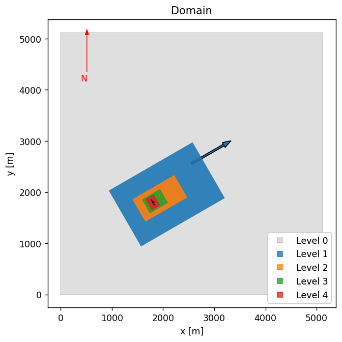

# Setting up the single turbine NREL5MW case in AMR-Wind

**Contents**

- [Prerequisites](#prerequisites)
- [Step 1: create the run directory](#step-1-create-the-run-directory)
- [Step 2: download the openfast model](#step-2-download-the-openfast-model)
- [Step 3: edit the file locations](#step-3-edit-the-file-locations)
- [Step 4: submit the run](#step-4-submit-the-run)
- [Turbine and mesh settings](#turbine-and-mesh-settings)
- [Optional: using the jupyter notebook](#optional-using-the-jupyter-notebook)

## Prerequisites

1.  Download the benchmarks repository

	```bash
	$ git clone --recursive git@github.com:Exawind/exawind-benchmarks.git BENCHMARKDIR
	```
    
    
    Here the optional argument `BENCHMARKDIR` is the location where you'd like the 
    benchmark repository to be cloned.  If it not provided, then the repo will be cloned into `exawind-benchmarks` in the current directory.


2.  Run the [slightly convective ABL benchmark](https://github.com/Exawind/exawind-benchmarks/tree/main/amr-wind/atmospheric_boundary_layer/convective_abl_nrel5mw) case.

    The NREL5MW case depends on initial conditions and boundary
    condition data which is generated during that ABL benchmark case,
    so it needs to be run before the NREL5MW case can be run.

3.  Download the [AMR-Wind frontend](https://github.com/Exawind/amr-wind-frontend) tool.

	The AMR-Wind frontend tool has useful utilities which can be used
    for setting up the OpenFAST turbine model and postprocessing
    results.  It is available on github and can be downloaded via

	```bash
	$ git clone --recursive git@github.com:Exawind/amr-wind-frontend.git AMRWINDFEDIR
	```

    where `AMRWINDFEDIR` is the location you'd like the tool to be
    located.  For the basic use of frontend-tool, the usual python 3
    libraries (numpy, scipy, pandas, etc.) are required.

## Step 1: create the run directory

Prepare a location where this case can be run.  This will likely be a location on the HPC where larger jobs can be run, and where lots of data (many gigabytes) can be stored.  First create the directory: 

```bash
$ mkdir RUNDIR
```

Note that `RUNDIR` can be an arbitrary name or location chosen to be convenient for the user or HPC system.  Then copy the necessary input files into `RUNDIR`

```bash
$ cp BENCHMARKDIR/amr-wind/actuator_line/NREL5MW_ALM_BD/input_files/NREL5MW_ALM_BD_OFv402.inp RUNDIR
$ cp BENCHMARKDIR/amr-wind/actuator_line/NREL5MW_ALM_BD/input_files/avg_theta.dat RUNDIR
$ cp BENCHMARKDIR/amr-wind/actuator_line/NREL5MW_ALM_BD/setup/nrel5mw_v402_rosco.yaml RUNDIR
```

## Step 2: download the openfast model

By default, the NREL5MW files required for the single turbine simulation are not included with the benchmarking repository.  However, they can be easily downloaded using some provided utilities.  First navigate to the run directory:

```bash
$ cd RUNDIR
```

Edit the file `nrel5mw_v402_rosco.yaml` and change the `DLL_FileName` parameter to point to the ROSCO library location:
```yaml
  ServoFile:
    # THIS ROSCO PATH NEEDS TO BE EDITED!
    DLL_FileName: PLEASEEDITTHIS
```
Note: if you leave it as `PLEASEEDITTHIS`, the next command will fail.

Then use the [`downloadOFmodel.py`](https://github.com/Exawind/amr-wind-frontend/blob/main/utilities/downloadOFmodel.py) to download all of the required turbine files.

```bash
$ AMRWINDFEDIR/utilities/downloadOFmodel.py nrel5mw_v402_rosco.yaml
```

The `downloadOFmodel.py` will pull the necessary files straight from the OpenFAST repo, ensure files are from the right OpenFAST version, and make edits to the OpenFAST parameters so that the turbine is correctly configured for this case.

Then change the name of the directory to match what is used in the input file
```bash
$ mv NREL5MW_v402_ROSCO/ T0_NREL5MW_v402_ROSCO/
```

## Step 3: edit the file locations

There are two edits required to the input file `NREL5MW_ALM_BD_OFv402.inp` in order to properly refer to the right locations.  The first is the location of the restart file: 

```
io.restart_file                          = /gpfs/lcheung/HFM/exawind-benchmarks/Neutral_ABL/chk30000
```

The second is the location of the boundary I/O files: 

```
ABL.bndry_file                           = /gpfs/lcheung/HFM/exawind-benchmarks/convective_abl/bndry_file
```

In each of these lines, change the path to match the location where the precursor directory was run.

## Step 4: submit the run

On many HPC platforms, a submission script needs to used to launch the case.  For slurm based systems, a submit script like this `submit.sh` file is used:
```bash
#!/bin/bash
#SBATCH --nodes=8
#SBATCH --time=47:59:59        # Wall clock time (HH:MM:SS) - once the job exceeds this time, the job will be terminated (default is 5 minutes)
#SBATCH --job-name=NREL5MW # Name of job
#SBATCH --partition=batch      # partition/queue name: short or batch
#SBATCH --qos=normal           # Quality of Service: long, large, priority or normal 
export nodes=$SLURM_JOB_NUM_NODES

# Load any required modules here
#module purge
#module load ...

export EXE=/projects/wind_uq/lcheung/AMRWindBuilds/hfm.20250211/amr-wind/build/amr_wind

# Number MPI processes to run on each node (a.k.a. PPN)
export cores=112
export ncpus=$((nodes * cores))
export OMP_PROC_BIND=spread 
export OMP_PLACES=threads

time mpiexec --bind-to core --npernode $cores --n $ncpus $EXE NREL5MW_ALM_BD_OFv402.inp 
```

Then, for slurm based queueing systems, submit the run with a command like:  
```
$ sbatch submit.sh
```

## Turbine and mesh settings

In this section we provide some explanations and context for the turbine and mesh parameter settings used in the simulation.

### Mesh and domain



The domain that is used in the NREL5MW case is the same as in the precursor ABL, namely one that has dimensions of 5120m x 5120m x 1920m.  The turbine base location is at (x,y) = (1800, 1800).  The background (level 0) grid uses a 10m resolution which is refined twice to reach 2.5m resolution at the rotor, for a total mesh size of approximately 70.5M.  Note that for the blade-resolved version of this run, two additional refinement zones are used, so the resolution at the rotor disk is 0.625m.

|Level | grid size |
| ---  | ---     |
| 0    | 10 m    |
| 1    | 5 m     |
| 2    | 2.5 m   |


### OpenFAST settings

The following changes need to be made to the default NREL5MW model.  These changes are automatically made `nrel5mw_v402_rosco.yaml`

**OpenFAST FST file**

|Parameter | Value | Comment |
|---       | ---   | ---     |
| DT       | 0.0008608815426997245 | Typically DT=0.005, but a smaller value is used for beamdyn |
| DT_Out   | 0.0215220385675       | Output OpenFAST data at 25 times `DT`     |
| CompElast | 2    | Use beamdyn module for structural modeling |
| CompInflow| 2    | Inflow is defined from external source (AMR-Wind)            |
| OutFileFmt| 3    |             |
| AirDens   | 1.00 | A density of 1.00 kg/m^3 was used in the precursor            |

**ElastoDyn file**

|Parameter | Value | Comment |
|---       | ---   | ---     |
| NacYaw   | 30.0  | This will align the turbine with the flow from 240 degrees (South-West) |
| YawDOF   | False | Fix the turbine yaw position in time |


**AeroDyn file**

|Parameter | Value | Comment |
|---       | ---   | ---     |
| Wake_Mod | 0     | Required when coupling OpenFAST with AMR-Wind|

Some of these changes are necessary when coupling OpenFAST with AMR-Wind, and many of these parameters are chosen to maintain consistency with the blade-resolved version of the NREL5MW run.  

Several of the settings related to blade-element momentum theory and unsteady aerodynamics model remain unchanged from the OpenFAST defaults.  For instance, the tip-loss and hub-loss models are not used in this simulation:

```
--- BEM algorithm 
True                   TipLoss     - Use the Prandtl tip-loss model? (flag) [unused when Wake_Mod=0 or 3]
True                   HubLoss     - Use the Prandtl hub-loss model? (flag) [unused when Wake_Mod=0 or 3]
True                   TanInd      - Include tangential induction in BEMT calculations? (flag) [unused when Wake_Mod=0 or 3]
False                  AIDrag      - Include the drag term in the axial-induction calculation? (flag) [unused when Wake_Mod=0 or 3]
False                  TIDrag      - Include the drag term in the tangential-induction calculation? (flag) [unused when Wake_Mod=0,3 or TanInd=FALSE]
"Default"              IndToler    - Convergence tolerance for BEMT nonlinear solve residual equation {or "default"} (-) [unused when Wake_Mod=0 or 3]
100                    MaxIter     - Maximum number of iteration steps (-) [unused when Wake_Mod=0]
```

and the default Beddoes-Leishman parameters are used here:

```
======  Unsteady Airfoil Aerodynamics Options  ====================================================
False                  AoA34       - Sample the angle of attack (AoA) at the 3/4 chord or the AC point {default=True} [always used]
3                      UA_Mod      - Unsteady Aero Model Switch (switch) {0=Quasi-steady (no UA), 2=B-L Gonzalez, 3=B-L Minnema/Pierce, 4=B-L HGM 4-states, 5=B-L HGM+vortex 5 states, 6=Oye, 7=Boeing-Vertol}
True                   FLookup     - Flag to indicate whether a lookup for f' will be calculated (TRUE) or whether best-fit exponential equations will be used (FALSE); if FALSE S1-S4 must be provided in airfoil input files (flag) [used only when UA_Mod>0]
0                      UAStartRad  - Starting radius for dynamic stall (fraction of rotor radius [0.0,1.0]) [used only when UA_Mod>0; if line is missing UAStartRad=0]
1                      UAEndRad    - Ending radius for dynamic stall (fraction of rotor radius [0.0,1.0]) [used only when UA_Mod>0; if line is missing UAEndRad=1]
```

**Beamdyn changes**

In addition to the changes listed above, we also remove one of the blade stations from the beamdyn blade definition files.  The second blade station is removed, so the total number of key points drops from 49 to 48.  This is also handled automatically through the `downloadOFmodel.py` step above.


<!--
```yaml
  FSTFile:
    DT: 0.0008608815426997245 # Typically 0.005, make smaller for beamdyn
    DT_Out: 0.0215220385675
    CompElast:  2  # use beamdyn
    CompInflow: 2
    OutFileFmt: 3
    AirDens:    1.000
  EDFile:
    NacYaw:   30.0
    YawDOF:   False
  AeroFile:
    Wake_Mod: 0
```
-->

### ALM settings

When using the actuator line method in AMR-Wind, several additional parameters need to be set for this case.  The number of actuator line points along the length of the blade and tower needs to be set, as well as the magnitude of epsilon, which sets the amount of smearing required for the applied force at each actuator force point.  These settings are defined through these parameters in the AMR-Wind input file:

```
Actuator.T0.num_points_blade             = 25                  
Actuator.T0.num_points_tower             = 11                  
Actuator.T0.epsilon                      = 1.5 1.5 1.5         
Actuator.T0.epsilon_tower                = 1.5 1.5 1.5         
```

## Optional: using the jupyter notebook

If you're interested in modifying the AMR-Wind input file, for instance, to change the refinement regions or sampling planes, you can use the Jupyter notebook [SetupALM_OFv402.ipynb](SetupALM_OFv402.ipynb).  This will allow you to visualize the loccations of the refinements or planes, and will generate the AMR-Wind input file [NREL5MW_ALM_BD_OFv402.inp](../input_files/NREL5MW_ALM_BD_OFv402.inp) at the end of the process.

There are a few modifications required to execute the notebook.  First, the location of the AMR-Wind frontend directory (and the utilities subdirectory) should be provided in the `amrwindfedirs` list here: 
```python
# Add any possible locations of amr-wind-frontend here
amrwindfedirs = ['/projects/wind_uq/lcheung/amrwind-frontend',
                 '/projects/wind_uq/lcheung/amrwind-frontend/utilities',
                ]
```

Secondly, the location of the precursor directory and the inputfile from the precursor run should be supplied in the `precursordir` directory and the `precursorsetup` input file, respectively.

```python
# Location of precursor run with boundary data
precursordir  = '/gpfs/lcheung/HFM/exawind-benchmarks/convective_abl'
precursorsetup= precursordir+'/neutral_abl_bndry.inp'
```

The location of the input files and openfast files will be set in the `farmrundir` variable: 
```python
farmrundir       = '../input_files' # Put all AMR-Wind input files here
```

The Jupyter notebook will take care of downloading the turbine model so **Step 2** above does not need to be executed, just set `downloadturbmodel=True` and `addturbdef = True`.

Once the notebook is executed, it will generate a set of three input files defined by these variables:

```python
outputfile       = 'NREL5MW_ALM_BD_OFv402.inp'   # Input file for AMR-Wind run with OpenFAST ALM turbine 
noturboutputfile = 'NREL5MW_ALM_BD_noturb.inp'   # Input file for AMR-Wind run with no turbine present
BRoutputfile     = 'NREL5MW_BR.inp'              # AMR-Wind input file for the blade-resolved run with ExaWind hybrid solver
```
