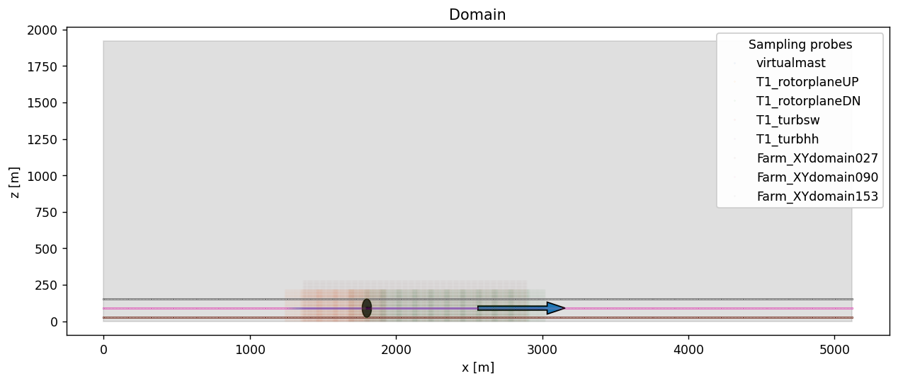

# Setting up the convective ABL in AMR-Wind

## Step 1.  Download the benchmarks repository

If the benchmark repository has not been downloaded, run the following command to clone it:  

```bash
$ git clone --recursive git@github.com:Exawind/exawind-benchmarks.git BENCHMARKDIR
```
    
Here the optional argument `BENCHMARKDIR` is the location where you'd like the benchmark repository to be cloned and the case to be run.  If it is not provided, then the repo will be cloned into `exawind-benchmarks` in the current directory.
    

## Step 2.  Run the precursor spin-up case

The first part of the ABL simulation will allow the turbulence to initialize and the boundary layer profile to develop.  The input file for this initial simulation is given by [convective_abl.inp](https://github.com/Exawind/exawind-benchmarks/tree/main/amr-wind/atmospheric_boundary_layer/convective_abl_nrel5mw/input_files/convective_abl.inp), and will last for 15,000 seconds.
    
To launch this case, navigate to the right directory and create a submission script:
    
```bash
$ cd BENCHMARKDIR/amr-wind/atmospheric_boundary_layer/convective_abl_nrel5mw/input_files
$ vi submit.sh
```

The submission script (called `submit.sh` above) will resemble something similar to the file below for slurm based HPC clusters.   Edit both the location of the `amr_wind` executable and any modules that might be required for the executable to run.
    
```bash
#!/bin/bash
#SBATCH --nodes=8
#SBATCH --time=47:59:59        # Wall clock time (HH:MM:SS) - once the job exceeds this time, the job will be terminated (default is 5 minutes)
#SBATCH --job-name=ABL # Name of job
#SBATCH --partition=batch      # partition/queue name: short or batch
#SBATCH --qos=normal           # Quality of Service: long, large, priority or normal 
export nodes=$SLURM_JOB_NUM_NODES

# Load any required modules here
#module purge
#module load ...

# Edit the location of the amr_wind executable here:
export EXE=/projects/wind_uq/lcheung/AMRWindBuilds/hfm.20250211/amr-wind/build/amr_wind

# Number MPI processes to run on each node (a.k.a. PPN)
export cores=112
export ncpus=$((nodes * cores))
export OMP_PROC_BIND=spread 
export OMP_PLACES=threads

time mpiexec --bind-to core --npernode $cores --n $ncpus $EXE convective_abl.inp 
```

Lastly, launch the simulation on the cluster with a command similar to
    
```bash
$ sbatch submit.sh
```

## Step 3.  Launch the statistics and sampling run.

After completing step 2, the ABL simulation is run for an additional 5,000 seconds to gather statistics and boundary inflow data.  The input file for this second run is given by [convective_abl_bndry.inp](https://github.com/Exawind/exawind-benchmarks/tree/main/amr-wind/atmospheric_boundary_layer/convective_abl_nrel5mw/input_files/convective_abl_bndry.inp).  To launch this case, use a similar submission as above, but edit the last line to use the new input file:

```bash
time mpiexec --bind-to core --npernode $cores --n $ncpus $EXE convective_abl_bndry.inp 
```


## Optional: using the jupyter notebook

If you're interested in modifying the AMR-Wind input file, for instance, to change the sampling plane locations, you can use the Jupyter notebook [convectiveABL_setup.ipynb](convectiveABL_setup.ipynb).  This will allow you to visualize the locations of the planes relative to the turbine position and wind direction, and will generate the AMR-Wind input file [convective_abl.inp](https://github.com/Exawind/exawind-benchmarks/tree/main/amr-wind/atmospheric_boundary_layer/convective_abl_nrel5mw/input_files/convective_abl.inp) at the end of the process.



In the image above, a side view of the domain is shown, with the potential location of an NREL5MW turbine shown in the black disk.  Sampling planes are placed at the heights z=27, 90, and 153m to calculate statistics, along with a virtual met-mast and inflow planes to characterize the inflow wind statistics to the turbine.

There are a few modifications required to execute the notebook.  First, the location of the AMR-Wind front end directory (and the utilities subdirectory) should be provided in the `amrwindfedirs` list here: 

```python
# Add any possible locations of amr-wind-frontend here
amrwindfedirs = ['/projects/wind_uq/lcheung/amrwind-frontend',
                 '/projects/wind_uq/lcheung/amrwind-frontend/utilities',
                ]
```

Also note that the notebook will refer to the following files and locations to output the input files.

```python
originalinput = 'abl.inp'
outputfile    = '../input_files/convective_abl.inp'
```
