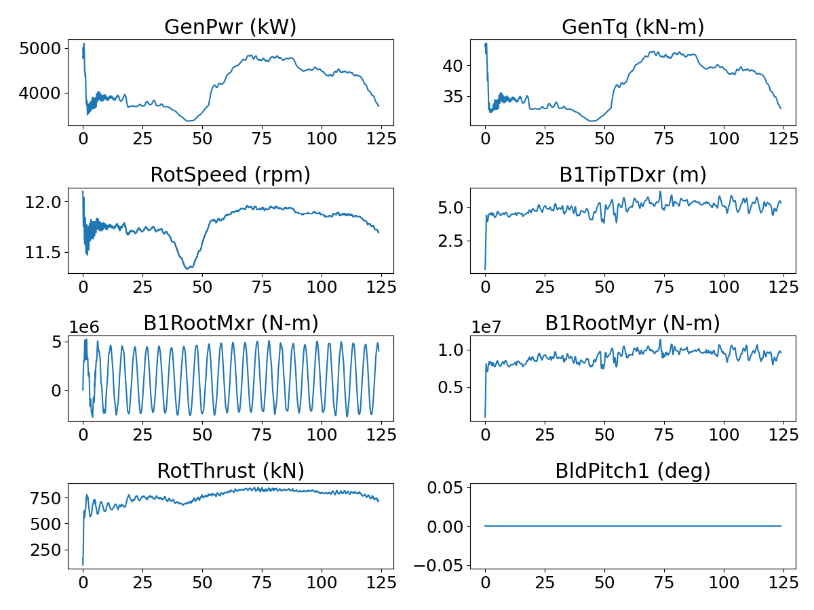

<!-- This file is automatically compiled into the website. Please copy linked files into .website_src/ paths to enable website rendering -->

# NREL 5MW Rotor in Atmospheric Boundary Layer With OpenFAST/BeamDyn Fluid Structure Interaction
This benchmark contains a geometry and boundary-layer resolved model of the NREL 5MW reference turbine [1] in a developed near-neutral convective atmospheric boundary layer with a mean hub-height streamwise velocity of 11.4m/s.

- Hub-height: 90m
- Blade Radius: 63m
- Rated Power: 5 MW
- Type: Upwind 3 Blade

<i>Note on run-time: Current results are for 125s simulation time, but by the time of bechmark release, a minimum of 360s will be posted.</i>

## Simulation Setup
- ExaWind driver SHA: [cba5259fc43ddeca67329630d3c84faad90e91bb](https://github.com/Exawind/exawind-driver/commit/cba5259fc43ddeca67329630d3c84faad90e91bb)
- Nalu-Wind SHA: [b9e4ae654b646ecd0501dd6391dc7537239c82db](https://github.com/Exawind/nalu-wind/commit/b9e4ae654b646ecd0501dd6391dc7537239c82db)
- AMR-Wind SHA: [091b07fa3840af98925792290fb8788696290a5e](https://github.com/Exawind/amr-wind/commit/091b07fa3840af98925792290fb8788696290a5e)
- OpenFAST 4.0 SHA: [da685d4997fd17ea845812c785325efa72edcf47](https://github.com/OpenFAST/openfast/commit/da685d4997fd17ea845812c785325efa72edcf47)  

## Freestream Conditions
A near-neutral convective boundary layer precursor was run to feed the domain for this case. Full details are posted here: [Convective ABL for NREL5MW](../../../amr-wind/atmospheric_boundary_layer/convective_abl_nrel5mw/README.md)

10 minute flow statistics:
- Hub-height streamwise velocity: 11.63 m/s
- Hub-height flow direction: ~240.0 degrees

## CFD Mesh

**Total number of cells: 177,729,426**

The near-body (Nalu-Wind) mesh was created using PGL, pyHyp, and Pointwise. Three blades are connected at the hub, and a tower is included.
- Structured hex mesh
- Cell count: 15,593,362

Off-body (AMR-Wind) mesh was generated using the built-in capability of AMR-Wind. Off-body mesh information is summarized below 
- Mesh topology: Cartesian with AMR
- Domain in x= 0 to 5000m, y=0m to 5000m, z=0m to 1000m
- Initial grid size: 10m
- Finest cell size: 0.625m with 4 AMR levels
- Cell count: 162,136,064

## Results

Mean values over time period: 65s to 125s 

- GenPwr: 4533.57 kW
- GenTq: 39.78 kN-m
- RotSpeed: 11.88 rpm
- RotThrust: 805.17 kN
- B1RootMxr: 1225828.64 N
- B1RootMyr: 9651238.99 N
- B1TipTDxr: 5.25 m
- BldPitch1: 0.0 deg

## Simulation Timings

This benchmark was run on Sandia National Laboratories' machine "Flight" which is comprised of 112 Intel(R) Xeon(R) Platinum 8480+ CPU cores per node. 

### Processor Decomposition: 
- Nalu-Wind: 672 ranks
- AMR-Wind: 6496 ranks

### Timings:
- Mean wall-clock time per timestep for entire simulation: 8.23s 
- Mean wall-clock time per timestep per cell 4.628e-08s

## References

[1]: Jonkman, J. et al, "Definition of a 5-MW Reference Wind Turbine for Offshore System Development" NREL/TP-500-38060, 2009. https://www.nrel.gov/docs/fy09osti/38060.pdf