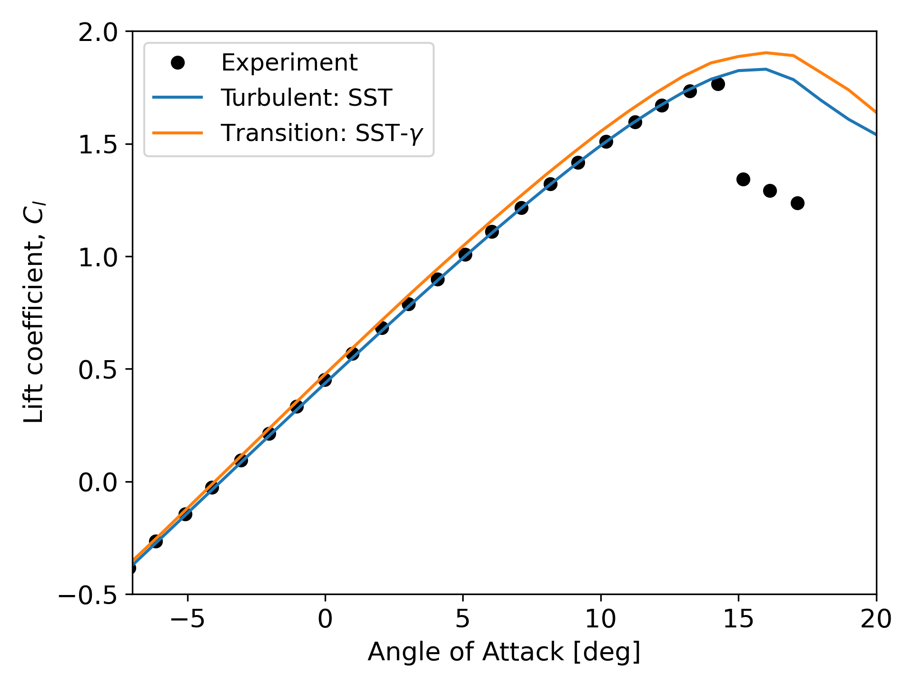
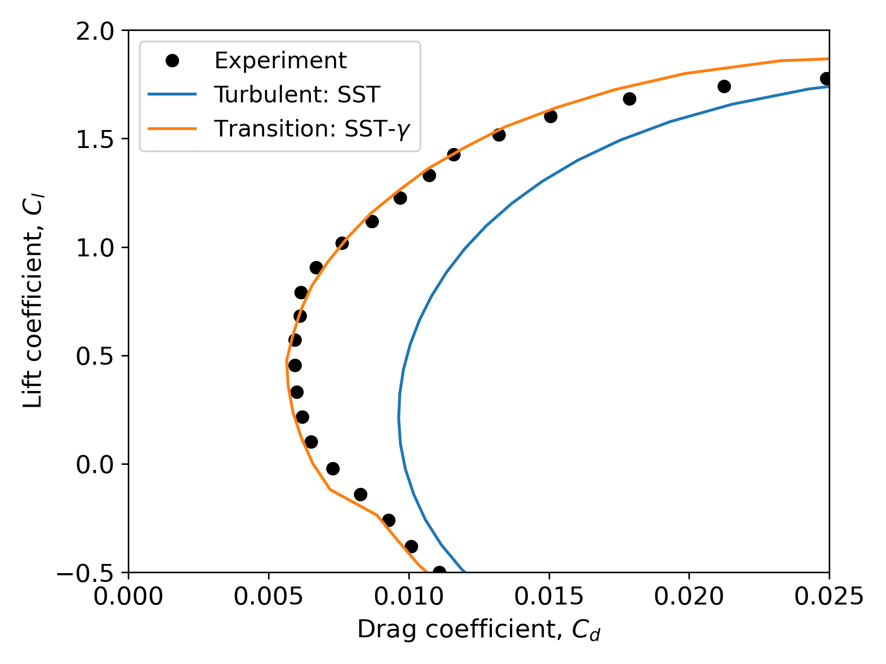

# NASA NLF(1)-0416

Validation and verification of the transition model is performed for NASA NLF(1)-0416 airfoil using Nalu-Wind with the 1-eq gamma transition model.
Six different mesh resolutions were tested, and the results were compared to those from NASA’s structred flow solver, OVERFLOW[^1], and unstructred flow solver, FUN3D[^2], using the same turbulence and transition models, CFD meshes, and inflow conditions.

## Simulation Conditions

- Test airfoil: NASA NLF(1)-0416 airfoil
- Flow Condition: M=0.1, Re=4million, Tu=0.15%
- CFD meshes with six different resoltuions provided by [AIAA CFD Transition Modeeling DG](https://transitionmodeling.larc.nasa.gov/) 
	-- Tiny, Coarse, Medium, Fine, Extra, Ultra[^3]
- Turbulence / Transition model: SST-2003 with the 1-eq Gamma transition model with µt/µ=1
- Nalu-Wind version: [6155b17fa6b8914a819a492230c96f7990a97b78](https://github.com/Exawind/nalu-wind/commit/6155b17fa6b8914a819a492230c96f7990a97b78)

## Results: Grid Sensitivity 

### Lift coefficient at AoA=5deg: 

### Drag coefficient at AoA=5deg

Two different options for the freestream conditions are tested here: 
1) Local turbulence intensity with the sustaining terms (green line): same way as the OVERFLOW and FUN3D simulations
2) Constant turbulence intensity without the sustaining terms (red line)

The grid sensitivitiy results are presented for the lift and drag coefficient. In the above figure, the x axis, h, is the 1/sqrt(total number of nodes), meaning smaller values correspond to finer grids. With the Option 1, Nalu-Wind results show similar trends to the FUN3D results. It is also seen that to achieve  the grid-converged trends, at least the third finest mesh resolution, ("Fine") is required. Overall, both Nalu-Wind and FUN3D show more mesh-dependence than OVERFLOW. This is attributed to the numerical shcemes of the unstructred flow solvers, which have lower aptial accuracy compared to structured flow solvers.

Option 2, which applies a constant turbulence intensity, improves grid convergence, particularly at lower mesh resolutions. For more consistent and accurate results with Nalu-Wind, Option 2 is recommended. However, it should be noted that Option 2 is valid only for single airfoil or single turbine simulations. For internal flow or multi-turbine cases, Option 1 should be used. Option 2 is activated only if fsti is explicitly specified in the Nalu-Wind input with a positive value.

## Results: AoA Sweep

### Comparison of the lift coefficient

### Comparison of the drag polar 

Based on the grid sensitivity results, a full sweep of angles of attack was performed using the Fine mesh level. The two figures above compare the lift and drag polar with the experimental measurements[^4]. For the lift, the transition simulation slightly over-predicts the lift coefficient in the linear range of the lift curve, a similar behavior also observed in transition predictions using other transition models. For the drag polar, the transition simulation predicts lower drag across the range of angles of attack than the fully turbulent simulation, capturing the trend of the experimental data very well.

## References
[^1]: Venkatachari et al., “Implementation and Assessment of Menter’s Galilean-Invariant 𝛾
Transition Model in OVERFLOW,” AIAA AVIATION 2023 Forum, 2023. https://doi.org/10.2514/6.2023-3533
[^2]: Hildebrand, et al., “Implementation and Verification of the SST-𝛾 and SA-AFT
Transition Models in FUN3D,” AIAA AVIATION 2023 Forum, 2023. https://doi.org/10.2514/6.2023-3530.
[^3]: Coder,J., "Standard Test Cases for Transition Model Verification and Validationin Computational Fluid Dynamics,” 56th AIAA Aerospace Sciences Meeting, January, 2018. https://doi.org/https://doi.org/10.2514/6.2018-0029.
[^4]: Somers,D.M.,“Design and Experimental Results for a Natural-Laminar-Flow Airfoil for General Aviation Applications,” Tech. Rep. 1861, NASA, 1981.
