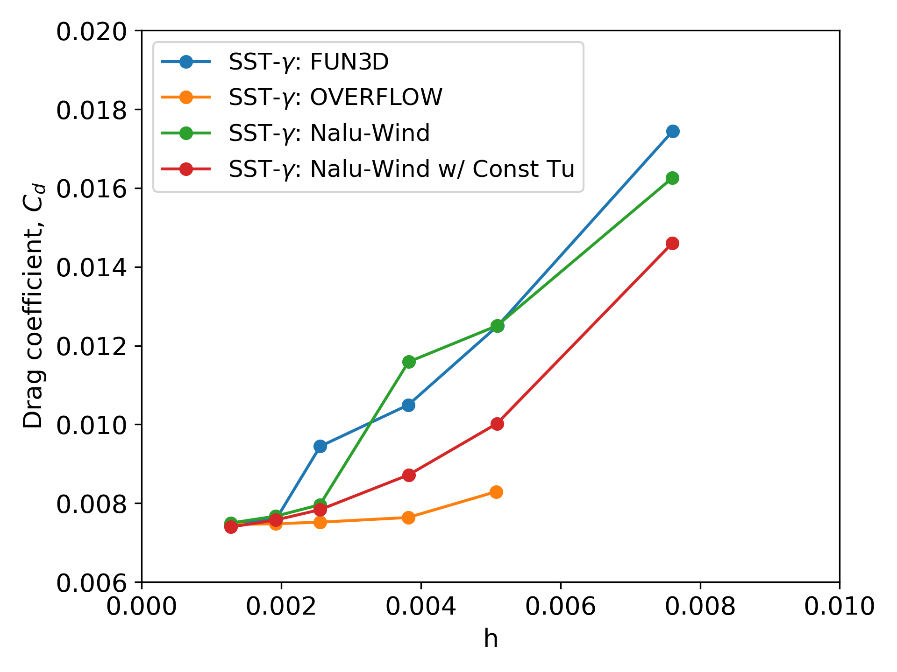

# Airfoil verification and validation 1: NASA NLF(1)-0416

A grid sensitivity study was performed for NASA NLF(1)-0416 airfoil using Nalu-Wind with the 1-eq gamma transition model.
Six different mesh resolutions were tested, and the results were compared to those from NASA’s structred flow solver, OVERFLOW[^1], and unstructred flow solver, FUN3D[^2], using the same turbulence and transition models, CFD meshes, and inflow conditions.

## Simulation Conditions

- Test airfoil: NASA NLF(1)-0416 airfoil
- Flow Condition: M=0.1, Re=4million, Tu=0.15%, Angle of Attack=5deg
- CFD meshes with six different resoltuions provided by [AIAA CFD Transition Modeeling DG](https://transitionmodeling.larc.nasa.gov/)
- Turbulence / Transition model: SST-2003 with the 1-eq Gamma transition model with µt/µ=1
- Nalu-Wind version: [6155b17fa6b8914a819a492230c96f7990a97b78](https://github.com/Exawind/nalu-wind/commit/6155b17fa6b8914a819a492230c96f7990a97b78)

## Results

### Lift coefficient at AoA=5deg: 

### Drag coefficient at AoA=5deg

Two different options for the freestream conditions are tested here: 
1) local turbulence intensity with the sustaining terms (green line): same way as the OVERFLOW and FUN3D simulations
2) a constant turbulence intensity without the sustaining terms (red line)

For the result with the option 1, Nalu-Wind results show similar trends as FUN3D results but slower convergence than OVERFLOW. This is due to the numerical shcemes of the unstructred flow solvers, which have lower-order of accuracy in space than the structured flow solvers.

On the ohter hand, the option 2, a constant turbulence intesntiy, improves the grid convergence with low mesh resolutions. 
For external flow, single airfoil or single turbine, the option 2 is recommended. On the other hand, for internal flow or multi-turbine cases, the option 1 should be used. 

Option 2 is acitcated only if fsti is explicitly specified in Nalu-Wind input with a positive value

## References
[^1]: Venkatachari et al., “Implementation and Assessment of Menter’s Galilean-Invariant 𝛾
Transition Model in OVERFLOW,” AIAA AVIATION 2023 Forum, 2023. https://doi.org/10.2514/6.2023-3533
[^2]: Hildebrand, et al., “Implementation and Verification of the SST-𝛾 and SA-AFT
Transition Models in FUN3D,” AIAA AVIATION 2023 Forum, 2023. https://doi.org/10.2514/6.2023-3530.

