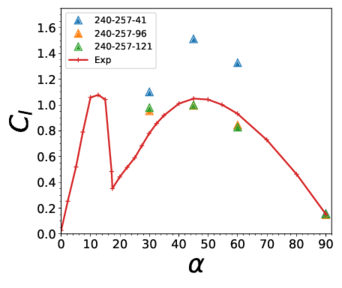

<!-- This file is automatically compiled into the website. Please copy linked files into .website_src/ paths to enable website rendering -->

# Three-dimensional (3D) flow past airfoils

These benchmark cases use IDDES for turbulence modeling, and they simulate flow past a NACA 0021 airfoil. Input files are provided for 4 angles of attack: 30, 45, 60 and 90 degrees.

The Nalu-Wind hash used was `4faf299`. Every case was run on Kestrel for at least 100 iterations to confirm input-file compatibility and provide profiling information in the log file footer. The 30 degree case was run with different numbers of nodes to establish scaling behavior, and the 45 degree case was run for 8000 steps to output force and moment results. 

These cases correspond to the following publication:
Bidadi, S.; Vijayakumar, G.; Sharma, A.; Sprague, M.A. Mesh and model requirements for capturing deep-stall aerodynamics in low-Mach-number flows. J. Turbul. 2023, 24, 393–418.


## Running the simulation

1. Download the benchmarks repository

	```bash
	$ git clone --recursive git@github.com:Exawind/exawind-benchmarks.git BENCHMARKDIR
	```

	Here BENCHMARKDIR is the location where you'd like the benchmark repository to be cloned and cases to be run. After cloning, download the meshes using DVC.
	The mesh files for each AOA can be found in the corresponding 'input_files' subdirectory.


2. To run one of AOA cases, load the ExaWind environment and execute the following command to run the simulation
	
	```bash
	$ mpirun -np NCPU naluX -i naca0021_aoa<AOA>.yaml 
	```	

   Here NCPU is the number of ranks to use in the simulation. Note the exact mpirun command to launch the case may differ between platforms, and might require a submission script to run on various clusters. 

   In the above command, <AOA> must be replaced the desired value of AOA.

   The yaml input file for each AOA, can be found in the "input_files" subdirectory.

   Note that, the subdirectory 'run_info' under each of the AOA directories contains a slurm example file to run the Nalu-Wind simulation with the corresponding yaml file. 


## Results




The above figure taken from the paper presents mesh resolution study results for the 
lift ($C_l$) and drag ($C_d$) profiles 
at $Re = 2.7\times10^5$. The number of spanwise points chosen are 41, 96 and 121, 
which correspond to 10, 24 and 30 cells per chord length.
In the chordwise and wall-normal directions, the number of points are fixed at 
240 and 257, respectively. The finer meshes provide good agreement with experiments for all 
angles of attack except at $17^\circ$. At this angle, the peak in $C_l$ is substantially
higher and is delayed compared to Swalwell et al. (2001) experimental results. 
In the deep stall regime, the percentage difference between the CFD and experimental results
is within or close to the $10\%$ threshold level on the finer spanwise grids.
The results show that, in the deep-stall regime, the IDDES model combined with atleast 24 cells per chord
accurately predicts the aerodynamic loads.

1. The experimental results for the left and drag coefficients can be found in NACA-0021/experimental_data directory.


2. The raw data from the Nalu-Wind runs corresponding to each AOA and spanwise resolution
can be found in the raw_data subdirectory under each AOA directory.


3. To generate the plots, execute the Python script in NACA-0021/plots. The script takes the location of
the NACA-0021 directory as an argument.
